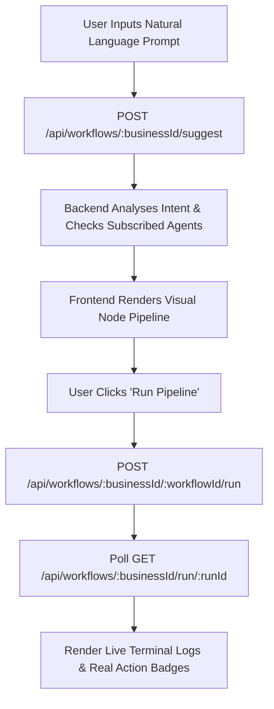

# HeyTam Core — Frontend Integration & Architecture Guide

> **Version:** 3.0.0  
> **Backend Service:** `heytam-core` (Port 4000)  
> **Audience:** Frontend Engineers, Full-Stack Developers, Product Integrators  
> **Purpose:** Comprehensive, step-by-step guide to integrate the complete 30-agent autonomous workforce into any frontend (React, Next.js, Vue, Mobile).

---

## 1. System Overview

`heytam-core` is a unified autonomous multi-agent backend engine. It combines a **Mastra AI Supervisor** with a workforce of **30 specialized Autonomous Slave Agents** organized into 4 functional Pods:

1. **Calling Pod (3 Agents):** Outbound AI telephony, Polly speech synthesis, and inbound front-desk reception.
2. **Mail Pod (6 Agents):** Form intake, email dispatch, lead qualification, SMS, WhatsApp, and website concierges.
3. **Marketing Pod (5 Agents):** Marketing campaigns, dormant client reactivation, Google reviews, referral programs, and growth analytics.
4. **CRM & Signals Pod (16 Agents):** Google Calendar bookings, no-show mitigations, waitlists, memberships, upsells, revenue collections, CRM database synchronization, and EMR/EHR clinical integration.

### Base URL & Health Check
- **Local Dev URL:** `http://localhost:4000`
- **Environment Variable:** `NEXT_PUBLIC_BACKEND_URL=http://localhost:4000`
- **Health Check:** `GET /health` or `GET /api/system/health`

```bash
curl http://localhost:4000/health
```
```json
{
  "status": "ok",
  "service": "heytam-core",
  "version": "3.0.0",
  "agents": {
    "total": 30,
    "pods": ["calling", "mail", "marketing", "crm"]
  }
}
```

---

## 2. Authentication & Multi-Tenancy

Every tenant (business) in `heytam-core` has an isolated data workspace, credentials store, and subscribed agent list.

### Required Request Headers
For authenticated endpoints:
```http
Authorization: Bearer <jwt_token>
Content-Type: application/json
x-tenant-id: <business_id>
```

### Authentication Endpoints

#### Register Business
`POST /api/auth/register`
```json
{
  "name": "Gold Eye Sight Clinic",
  "ownerName": "Dr. Shivam Awasthi",
  "email": "owner@clinic.com",
  "password": "SecurePassword123!",
  "phone": "+15551234567",
  "location": "New York, NY",
  "services": ["LASIK Consultation", "Eye Examination", "Cataract Care"]
}
```
**Response (201 Created):**
```json
{
  "success": true,
  "token": "eyJhbGciOiJIUzI1NiIsInR5cCI6IkpXVCJ9...",
  "business": {
    "id": "biz_1790004412473_jo1fh",
    "name": "Gold Eye Sight Clinic",
    "email": "owner@clinic.com",
    "plan": { "name": "Growth", "monthlyFee": 299 }
  }
}
```

#### Login Business
`POST /api/auth/login`
```json
{
  "email": "owner@clinic.com",
  "password": "SecurePassword123!"
}
```
**Response (200 OK):**
```json
{
  "success": true,
  "token": "eyJhbGciOiJIUzI1NiIsInR5cCI6IkpXVCJ9...",
  "business": {
    "id": "biz_1790004412473_jo1fh",
    "name": "Gold Eye Sight Clinic"
  }
}
```

---

## 3. Subscription & Agent Marketplace Model

`heytam-core` enforces a dynamic, subscription-aware agent model:

### Starter vs. Full Workforce
1. **Starter Subscription (Default):** A newly created business starts with **6 essential tools**:
   - `lead-concierge` (Intake & Sheet Parsing)
   - `booking-agent` (Calendar & Reservations)
   - `follow-up-agent` (Email Follow-ups)
   - `voice-agent` (Outbound Calling)
   - `lead-qualifier` (Lead Scoring)
   - `no-show-prevention-agent` (Confirmations)
2. **All-Agents / Enterprise:** All **30 AI agents** are unlocked simultaneously.

### Marketplace Endpoints

#### 1. Get Marketplace Catalog
`GET /api/tools/catalog` (Public / Authenticated)  
Returns all 30 tools with pricing, capabilities, and pre-built bundles (`starter_comms`, `booking_suite`, `growth_suite`).

#### 2. Get Business's Subscribed Agents
`GET /api/tools/:businessId` *(Requires Bearer Token)*  
Returns the array of active tools for this business.

#### 3. Activate Single Agent
`POST /api/tools/:businessId/activate` *(Requires Bearer Token)*
```json
{ "toolId": "upsell-agent" }
```

#### 4. Activate Bundle
`POST /api/tools/:businessId/activate-bundle` *(Requires Bearer Token)*
```json
{ "bundleId": "growth_suite" }
```

#### 5. Activate All 30 Agents (Enterprise)
`POST /api/tools/:businessId/activate-all` *(Requires Bearer Token)*  
Unlocks the entire 30-agent workforce and sets `plan: "Enterprise All-Agents"`.

#### 6. Deactivate Agent
`DELETE /api/tools/:businessId/:toolId` *(Requires Bearer Token)*

---

## 4. The Core Workflow Lifecycle

This is the primary user journey in the frontend:


---

### Step 1: Suggest Workflow from Natural Language Prompt

`POST /api/workflows/:businessId/suggest`  
*(Or public endpoint `POST /api/suggest` with `{ prompt, businessId }`)*

#### Request:
```json
{
  "prompt": "Suggest a premium package upsell to ayush sharma for facial treatment and book calendar"
}
```

#### Response (When Business Has All Agents Subscribed):
```json
{
  "success": true,
  "suggestion": {
    "name": "Revenue Upsell & Treatment Upgrade Flow",
    "description": "Presents tailored service upgrades and treatment add-ons to clients.",
    "trigger": "Upsell Opportunity Trigger",
    "explanation": "Upsell Agent identifies high-value treatment enhancements and presents proposals to clients.",
    "steps": [
      { "order": 1, "agentId": "upsell-agent", "agentName": "Upsell Agent" },
      { "order": 2, "agentId": "booking-agent", "agentName": "Booking Agent" }
    ],
    "subscriptionContext": {
      "allAgentsSubscribed": true,
      "subscribedCount": 30,
      "adaptedSteps": false
    },
    "extractedTriggerData": {
      "recipientName": "ayush sharma",
      "service": "Service Upsell",
      "prompt": "Suggest a premium package upsell to ayush sharma for facial treatment and book calendar"
    }
  }
}
```

#### Response (When Business Only Has Starter Tools):
`heytam-core` automatically adapts the pipeline steps to the business's active tools so execution **never breaks**:
```json
{
  "success": true,
  "suggestion": {
    "name": "Revenue Upsell & Treatment Upgrade Flow",
    "description": "Presents tailored service upgrades and treatment add-ons to clients.",
    "trigger": "Upsell Opportunity Trigger",
    "explanation": "Upsell Agent identifies high-value treatment enhancements. (Optimized for your subscribed agents: using Follow-up Agent ➔ Booking Agent).",
    "steps": [
      { "order": 1, "agentId": "follow-up-agent", "agentName": "Follow-up Agent" },
      { "order": 2, "agentId": "booking-agent", "agentName": "Booking Agent" }
    ],
    "subscriptionContext": {
      "allAgentsSubscribed": false,
      "subscribedCount": 6,
      "adaptedSteps": true
    }
  }
}
```

---

### Step 2: Execute the Pipeline

`POST /api/workflows/:businessId/:workflowId/run`

#### Request:
```json
{
  "prompt": "Suggest a premium package upsell to ayush sharma for facial treatment",
  "workflow": {
    "name": "Revenue Upsell & Treatment Upgrade Flow",
    "steps": [
      { "order": 1, "agentId": "upsell-agent", "agentName": "Upsell Agent" },
      { "order": 2, "agentId": "booking-agent", "agentName": "Booking Agent" }
    ]
  },
  "triggerData": {
    "recipientName": "Ayush Sharma",
    "recipientEmail": "ayush@example.com"
  }
}
```

#### Response (Success — Status 200):
```json
{
  "runId": "48b61f87-2591-4475-8120-cfc9cbe7cf31"
}
```

#### Response (Subscription Required — Status 402):
If the workflow contains an unsubscribed agent and the tenant is not on an Enterprise plan:
```json
{
  "success": false,
  "error": "Subscription required",
  "message": "This workflow requires agent(s) your business has not subscribed to: Voice Agent. Please go to the Agent Marketplace and activate this agent first.",
  "unsubscribedAgents": ["Voice Agent"],
  "action": "GO_TO_MARKETPLACE"
}
```
> **Frontend Handling for 402:** Open a modal or redirect the user directly to the Agent Marketplace tab with a button to activate the required agent.

---

### Step 3: Poll Live Execution Progress

`GET /api/workflows/:businessId/run/:runId`

Poll this endpoint every **1000ms** until `status === "completed"` or `"failed"` or `"blocked"`.

#### Response:
```json
{
  "success": true,
  "run": {
    "id": "48b61f87-2591-4475-8120-cfc9cbe7cf31",
    "status": "completed",
    "startedAt": "2026-09-30T17:00:00.000Z",
    "completedAt": "2026-09-30T17:00:08.500Z",
    "totalDurationMs": 8500,
    "workflow": {
      "name": "Revenue Upsell & Treatment Upgrade Flow",
      "steps": [
        { "order": 1, "agentId": "upsell-agent", "agentName": "Upsell Agent" },
        { "order": 2, "agentId": "booking-agent", "agentName": "Booking Agent" }
      ]
    },
    "steps": [
      {
        "order": 1,
        "agentId": "upsell-agent",
        "agentName": "Upsell Agent",
        "durationMs": 4200,
        "result": {
          "status": "success",
          "actionsExecuted": [
            "REAL: Email sent to ayush@example.com via SMTP (Subject: \"Recommended Service Upgrade & Package Proposal\", Message ID: <e83a-49c@gmail.com>)"
          ]
        }
      },
      {
        "order": 2,
        "agentId": "booking-agent",
        "agentName": "Booking Agent",
        "durationMs": 4300,
        "result": {
          "status": "success",
          "actionsExecuted": [
            "REAL: Google Calendar event created: https://www.google.com/calendar/event?eid=dWFmZ3BzNjE4dTljajI2..."
          ]
        }
      }
    ],
    "orchestratorLog": [
      "[HeyTam Core Supervisor] Dispatching pipeline: \"Revenue Upsell & Treatment Upgrade Flow\"",
      "[Step 1] Executing Upsell Agent (upsell-agent)...",
      "[Step 1] REAL: Email sent to ayush@example.com via SMTP (Subject: \"Recommended Service Upgrade & Package Proposal\")",
      "[Step 1] Completed in 4200ms",
      "[Step 2] Executing Booking Agent (booking-agent)...",
      "[Step 2] REAL: Google Calendar event created: https://www.google.com/calendar/event?eid=...",
      "[Step 2] Completed in 4300ms",
      "[HeyTam Core Supervisor] All 2 pipeline steps concluded."
    ]
  }
}
```

---

## 5. Third-Party Integrations & Credentials

Agents execute **REAL** external actions. The frontend should provide UI forms to configure these credentials:

| Provider | Purpose | Required Fields | Agents Utilizing |
| :--- | :--- | :--- | :--- |
| **Twilio** | Real phone calls, SMS & WhatsApp | `twilioAccountSid` (or API Key SID), `twilioAuthToken` (or Client Secret), `twilioFromPhone` | `voice-agent`, `outbound-calling-agent`, `sms-concierge`, `whatsapp-concierge` |
| **Google OAuth** | Google Calendar & Gmail reading | `googleClientId`, `googleClientSecret`, `googleRefreshToken` | `booking-agent`, `rebooking-agent`, `waitlist-agent`, `lead-concierge` |
| **SMTP / Gmail** | Branded email delivery | `smtpHost`, `smtpPort` (587/465), `smtpUser`, `smtpPass`, `smtpFrom` | All 14 Email & Outreach agents |
| **MongoDB / DB** | Contact & lead sync | `mongoUri`, `mongoDatabase` | `crm-agent` |

### Integration Endpoints

#### Google OAuth Connect Flow
1. Fetch auth URL: `GET /api/tools/oauth/google/auth-url?businessId=<businessId>`
2. Frontend redirects user to returned Google URL.
3. User logs in and approves permissions (Calendar + Gmail).
4. Google redirects back to backend callback `GET /api/tools/oauth/google/callback`, which automatically stores OAuth tokens in persistent store.

#### Save Twilio Credentials
`POST /api/tools/:businessId/configure/voice-agent` (or `twilio`)
```json
{
  "twilioAccountSid": "ACxxxxxxxxxxxxxxxxxxxxxxxxxxxxxxxx",
  "twilioAuthToken": "your_auth_token_or_api_secret",
  "twilioFromPhone": "+1855XXXXXXX"
}
```

#### Save SMTP Credentials
`POST /api/tools/:businessId/configure/follow-up-agent` (or `smtp`)
```json
{
  "smtpHost": "smtp.gmail.com",
  "smtpPort": 587,
  "smtpUser": "business@gmail.com",
  "smtpPass": "abcd efgh ijkl mnop",
  "smtpFrom": "Gold Eye Sight <business@gmail.com>"
}
```

#### Test Any Integration
`POST /api/tools/:businessId/test/:toolId`  
Returns `{ success: true, message: "Connected successfully" }` or connection error details.

---

## 6. Complete 30-Agent Directory Reference

| Pod | Agent ID | Agent Name | Real Action Executed | Required Credential |
| :--- | :--- | :--- | :--- | :--- |
| **Calling** | `voice-agent` | Voice Agent | Outbound telephone call with Polly TTS | Twilio Voice |
| **Calling** | `outbound-calling-agent` | Outbound Calling Agent | Autonomous voice follow-up loop | Twilio Voice |
| **Calling** | `receptionist-agent` | Receptionist Agent | Caller inquiry transcript structuring | None (Pure AI) |
| **Mail** | `lead-concierge` | Lead Concierge | Google Sheets CSV extraction & Gmail reading | Google OAuth |
| **Mail** | `lead-qualifier` | Lead Qualifier | Intent, budget & urgency scoring | None (Pure AI) |
| **Mail** | `follow-up-agent` | Follow-up Agent | Direct branded follow-up email | SMTP |
| **Mail** | `sms-concierge` | SMS Concierge | Real text messages via Twilio | Twilio SMS |
| **Mail** | `whatsapp-concierge` | WhatsApp Concierge | WhatsApp messaging via Twilio | Twilio WhatsApp |
| **Mail** | `web-concierge` | Web Concierge | Chatbot FAQ answering & inquiry capture | None (Pure AI) |
| **Marketing**| `campaign-agent` | Campaign Agent | Branded promotional marketing email | SMTP |
| **Marketing**| `reactivation-agent` | Reactivation Agent | 90+ day dormant client win-back email | SMTP |
| **Marketing**| `review-agent` | Review Agent | 5-star Google review request email | SMTP |
| **Marketing**| `referral-agent` | Referral Agent | Referral program invite & rewards email | SMTP |
| **Marketing**| `growth-analyst` | Growth Analyst | Business intelligence KPI & cohort report | None (Pure AI) |
| **CRM** | `crm-agent` | CRM Agent | Contact record upsert to MongoDB / DB | MongoDB / DB |
| **CRM** | `booking-agent` | Booking Agent | Google Calendar event insertion + reminders | Google Calendar |
| **CRM** | `rebooking-agent` | Rebooking Agent | Next-appointment scheduling | Google Calendar |
| **CRM** | `waitlist-agent` | Waitlist Agent | Cancellation fill & waitlist calendar event | Google Calendar |
| **CRM** | `no-show-prevention-agent` | No-Show Prevention Agent| Pre-appointment alert & confirmation email | SMTP |
| **CRM** | `cancellation-recovery-agent`| Cancellation Recovery | Rescheduling alternatives outreach email | SMTP |
| **CRM** | `membership-agent` | Membership Agent | VIP membership perks & renewal email | SMTP |
| **CRM** | `upsell-agent` | Upsell Agent | Treatment package upgrade proposal email | SMTP |
| **CRM** | `revenue-recovery-agent` | Revenue Recovery Agent | Outstanding balance & invoice statement | SMTP |
| **CRM** | `treatment-advisor` | Treatment Advisor | Clinical guidance & procedure description | None (Pure AI) |
| **CRM** | `patient-concierge` | Patient Concierge | Onboarding & care coordination email | SMTP |
| **CRM** | `post-treatment-agent` | Post-Treatment Agent | After-care instructions & recovery tips email| SMTP |
| **CRM** | `front-desk-copilot` | Front Desk Copilot | Staff scheduling assistance & dispatch | SMTP |
| **CRM** | `lead-recovery-agent` | Lead Recovery Agent | Ghosted/lost lead re-engagement email | SMTP |
| **CRM** | `emr-ehr-integration-agent` | EMR/EHR Agent | Clinical HL7/FHIR record validation | EMR / FHIR |
| **CRM** | `integration-guardian` | Integration Guardian | Health check ping across Twilio, Google, SMTP| None (Health Ping)|

---

## 7. Ready-to-Use Frontend Integration Code (TypeScript / Next.js / React)

### `lib/heytamClient.ts`
```typescript
/**
 * HeyTam Core API Client
 * Drop this file into your frontend project (e.g. lib/heytamClient.ts)
 */

const BASE_URL = process.env.NEXT_PUBLIC_BACKEND_URL || 'http://localhost:4000';

function getAuthHeader(): Record<string, string> {
  const token = typeof window !== 'undefined' ? localStorage.getItem('heytam_token') : null;
  return token ? { Authorization: `Bearer ${token}` } : {};
}

export interface WorkflowSuggestion {
  name: string;
  description: string;
  trigger: string;
  steps: Array<{ order: number; agentId: string; agentName: string }>;
  explanation: string;
  subscriptionContext?: {
    allAgentsSubscribed: boolean;
    subscribedCount: number;
    adaptedSteps: boolean;
    requiredActivations?: string[];
  };
}

export interface RunResult {
  runId?: string;
  error?: string;
  unsubscribedAgents?: string[];
  action?: string;
}

/**
 * 1. Suggest a multi-agent workflow from natural language
 */
export async function suggestWorkflow(businessId: string, prompt: string): Promise<WorkflowSuggestion> {
  const res = await fetch(`${BASE_URL}/api/workflows/${businessId}/suggest`, {
    method: 'POST',
    headers: {
      'Content-Type': 'application/json',
      ...getAuthHeader(),
    },
    body: JSON.stringify({ prompt }),
  });

  const data = await res.json();
  if (!res.ok) throw new Error(data.error || 'Failed to suggest workflow');
  return data.suggestion;
}

/**
 * 2. Execute a multi-agent workflow
 */
export async function runWorkflow(
  businessId: string,
  workflowId: string,
  payload: { prompt?: string; workflow?: any; triggerData?: any }
): Promise<RunResult> {
  const res = await fetch(`${BASE_URL}/api/workflows/${businessId}/${workflowId}/run`, {
    method: 'POST',
    headers: {
      'Content-Type': 'application/json',
      ...getAuthHeader(),
    },
    body: JSON.stringify(payload),
  });

  const data = await res.json();
  if (res.status === 402) {
    return {
      error: data.message,
      unsubscribedAgents: data.unsubscribedAgents,
      action: data.action,
    };
  }
  if (!res.ok) throw new Error(data.error || 'Execution failed');
  return { runId: data.runId };
}

/**
 * 3. Poll workflow run status and live logs
 */
export async function getWorkflowRun(businessId: string, runId: string) {
  const res = await fetch(`${BASE_URL}/api/workflows/${businessId}/run/${runId}`, {
    headers: getAuthHeader(),
  });
  const data = await res.json();
  if (!res.ok) throw new Error(data.error || 'Failed to fetch run status');
  return data.run;
}

/**
 * 4. Activate All 30 Agents (Enterprise / All Agents Bought)
 */
export async function activateAllAgents(businessId: string) {
  const res = await fetch(`${BASE_URL}/api/tools/${businessId}/activate-all`, {
    method: 'POST',
    headers: {
      'Content-Type': 'application/json',
      ...getAuthHeader(),
    },
  });
  return res.json();
}
```

---

### React Component: Prompt $\rightarrow$ Pipeline Execution Example

```tsx
import React, { useState } from 'react';
import { suggestWorkflow, runWorkflow, getWorkflowRun, WorkflowSuggestion } from '@/lib/heytamClient';

export default function OrchestratorConsole({ businessId }: { businessId: string }) {
  const [prompt, setPrompt] = useState('');
  const [suggestion, setSuggestion] = useState<WorkflowSuggestion | null>(null);
  const [logs, setLogs] = useState<string[]>([]);
  const [isRunning, setIsRunning] = useState(false);
  const [errorMsg, setErrorMsg] = useState<string | null>(null);

  // 1. Suggest pipeline on typing or submit
  const handleSuggest = async () => {
    if (!prompt.trim()) return;
    setErrorMsg(null);
    try {
      const result = await suggestWorkflow(businessId, prompt);
      setSuggestion(result);
    } catch (err: any) {
      setErrorMsg(err.message);
    }
  };

  // 2. Run pipeline & poll live progress
  const handleRun = async () => {
    if (!suggestion) return;
    setIsRunning(true);
    setLogs(['Initiating pipeline execution...']);
    setErrorMsg(null);

    try {
      const { runId, error, unsubscribedAgents, action } = await runWorkflow(
        businessId,
        'workflow_' + Date.now(),
        { prompt, workflow: suggestion }
      );

      if (action === 'GO_TO_MARKETPLACE') {
        setErrorMsg(`Missing subscription for: ${unsubscribedAgents?.join(', ')}. Please activate in Marketplace.`);
        setIsRunning(false);
        return;
      }

      // Poll until finished
      const pollTimer = setInterval(async () => {
        const run = await getWorkflowRun(businessId, runId!);
        if (run.orchestratorLog) setLogs(run.orchestratorLog);

        if (run.status === 'completed' || run.status === 'failed' || run.status === 'blocked') {
          clearInterval(pollTimer);
          setIsRunning(false);
        }
      }, 1000);
    } catch (err: any) {
      setErrorMsg(err.message);
      setIsRunning(false);
    }
  };

  return (
    <div className="p-6 max-w-4xl mx-auto space-y-6">
      <h1 className="text-2xl font-bold">HeyTam AI Workforce Console</h1>

      {/* Natural Language Prompt */}
      <div className="flex gap-3">
        <input
          type="text"
          className="flex-1 border p-3 rounded-lg"
          placeholder="e.g. Read Google Sheet and schedule everyone on Google Calendar"
          value={prompt}
          onChange={(e) => setPrompt(e.target.value)}
        />
        <button onClick={handleSuggest} className="bg-blue-600 text-white px-5 py-3 rounded-lg font-semibold">
          Analyze Intent
        </button>
      </div>

      {errorMsg && <div className="p-4 bg-red-100 text-red-700 rounded-lg">{errorMsg}</div>}

      {/* Suggested Visual Node Pipeline */}
      {suggestion && (
        <div className="border p-5 rounded-lg bg-gray-50 space-y-4">
          <div className="flex justify-between items-center">
            <h2 className="text-lg font-bold text-gray-800">{suggestion.name}</h2>
            <button
              onClick={handleRun}
              disabled={isRunning}
              className="bg-emerald-600 text-white px-6 py-2 rounded-md font-bold hover:bg-emerald-700 disabled:opacity-50"
            >
              {isRunning ? 'Running Pipeline...' : 'Run Pipeline'}
            </button>
          </div>
          <p className="text-sm text-gray-600">{suggestion.explanation}</p>

          {/* Steps */}
          <div className="flex items-center gap-3 overflow-x-auto py-2">
            {suggestion.steps.map((step, idx) => (
              <React.Fragment key={step.agentId}>
                <div className="bg-white border shadow-sm px-4 py-3 rounded-lg min-w-[160px]">
                  <div className="text-xs text-blue-600 font-bold">STEP {step.order}</div>
                  <div className="font-semibold text-gray-900">{step.agentName}</div>
                </div>
                {idx < suggestion.steps.length - 1 && <span className="text-gray-400 font-bold">➔</span>}
              </React.Fragment>
            ))}
          </div>
        </div>
      )}

      {/* Live Terminal Logs */}
      {logs.length > 0 && (
        <div className="bg-gray-900 text-green-400 p-4 rounded-lg font-mono text-xs space-y-1 max-h-80 overflow-y-auto">
          {logs.map((log, i) => (
            <div key={i}>{log}</div>
          ))}
        </div>
      )}
    </div>
  );
}
```

---

## 8. Summary Checklist for Frontend Integration

- [x] Configure `NEXT_PUBLIC_BACKEND_URL=http://localhost:4000` (or production domain).
- [x] Attach `Authorization: Bearer <token>` to all authenticated requests.
- [x] Call `POST /api/workflows/:businessId/suggest` on user prompt to get visual node pipeline steps.
- [x] Call `POST /api/workflows/:businessId/:workflowId/run` to dispatch the multi-agent flow.
- [x] Catch HTTP `402` responses and direct users to activate required tools in the Marketplace.
- [x] Poll `GET /api/workflows/:businessId/run/:runId` every 1000ms to stream live terminal logs and action execution records.
- [x] Provide a Settings / Integrations tab for connecting Google OAuth, Twilio, and SMTP.
- [x] Provide an "Activate All Agents" button calling `POST /api/tools/:businessId/activate-all` for Enterprise upgrades.
